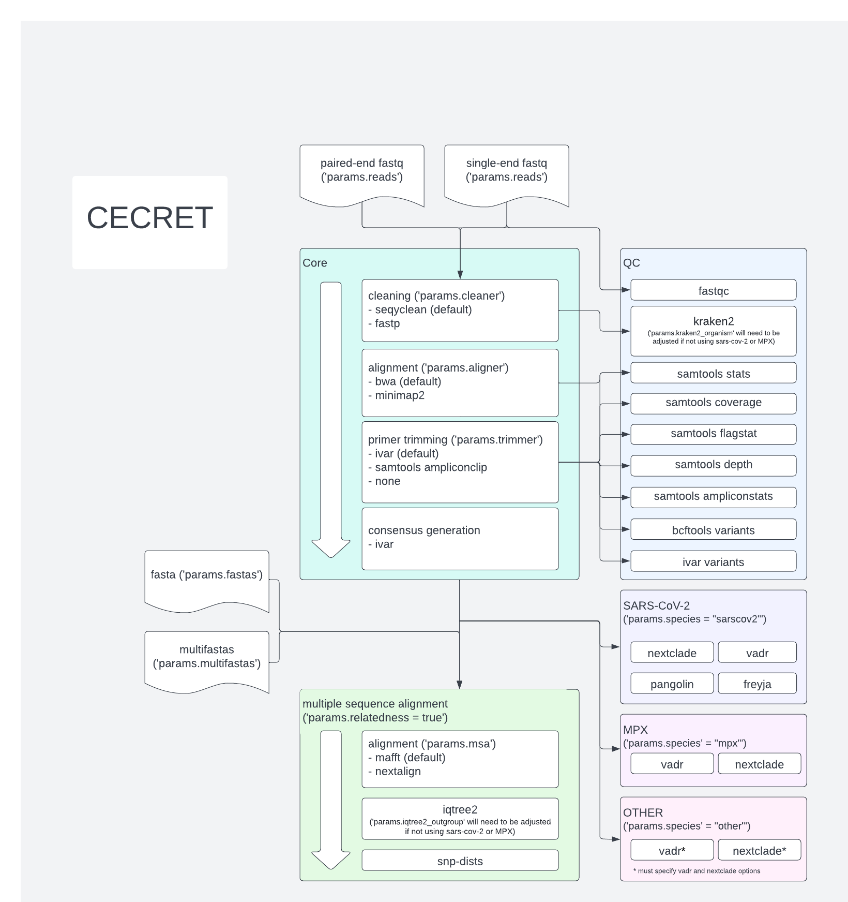
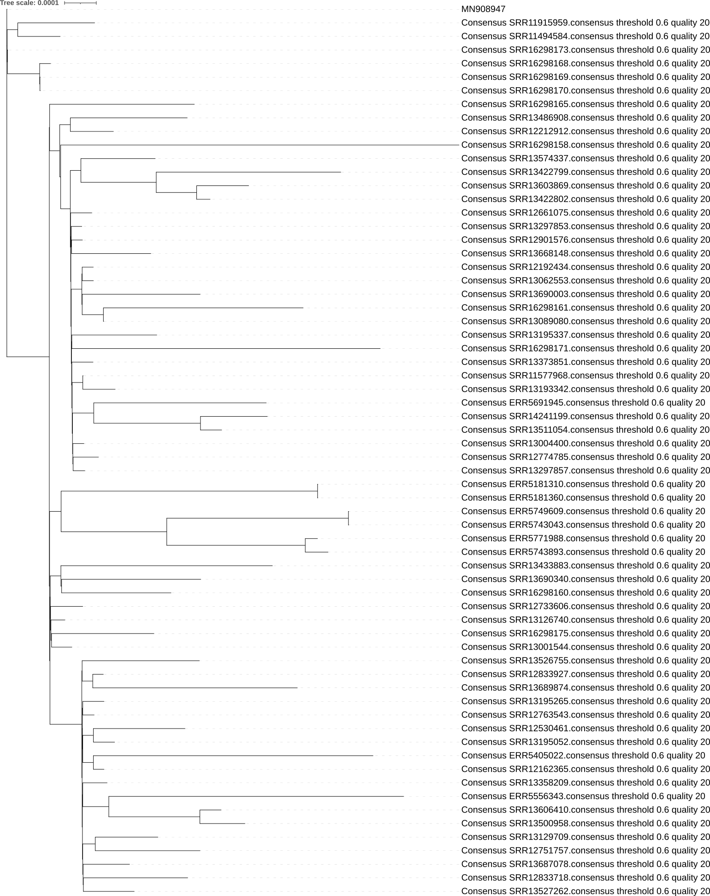
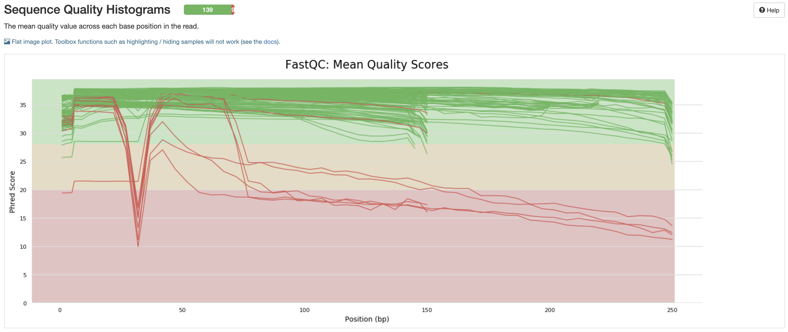
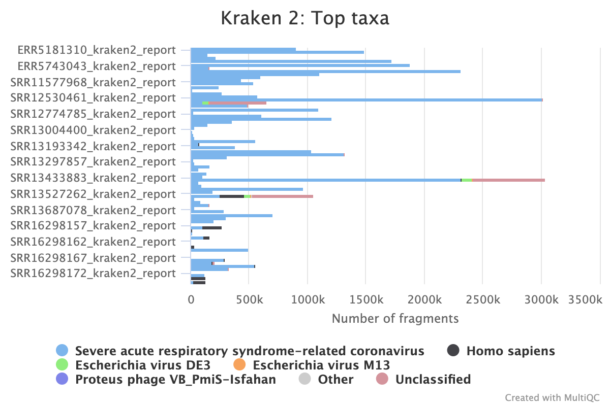
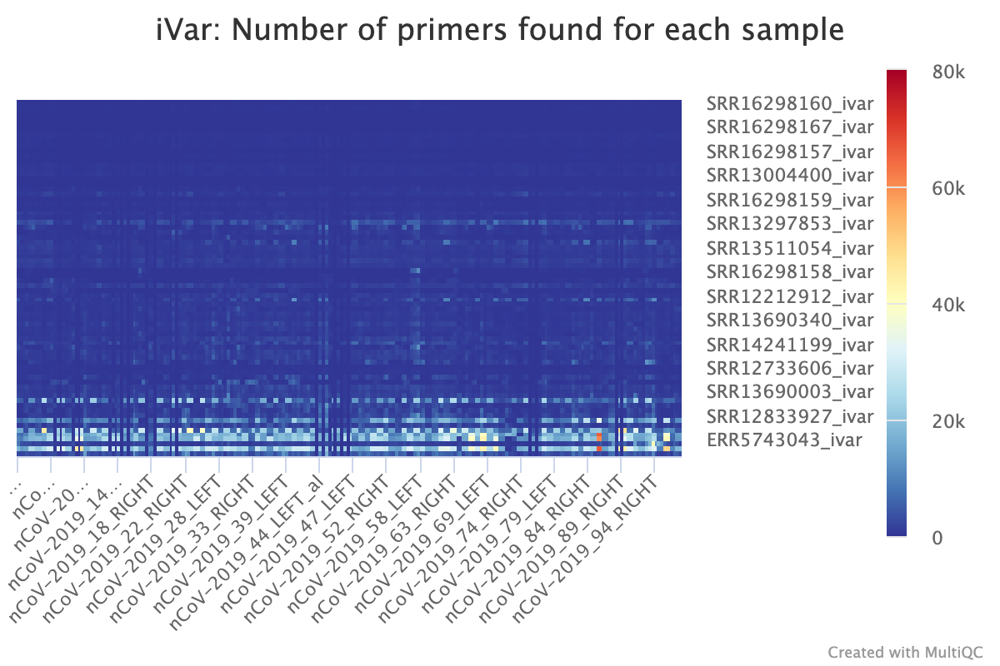
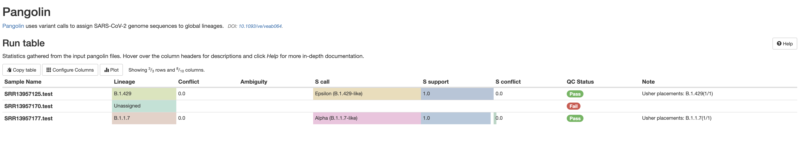
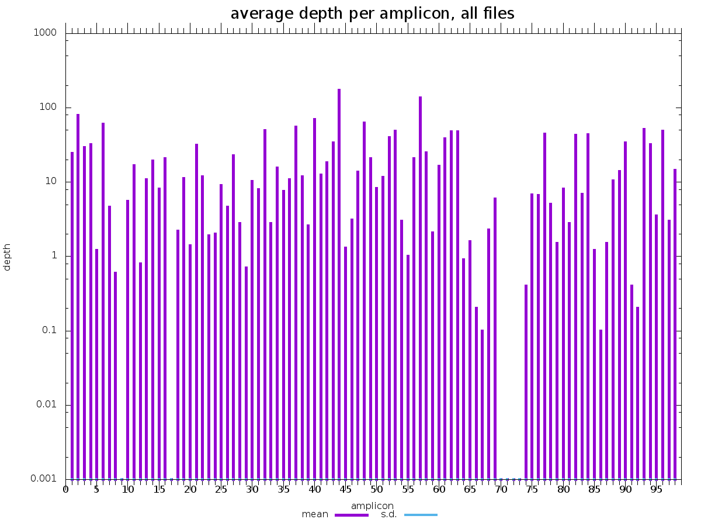

# Cecret


Named after the beautiful [Cecret lake](https://en.wikipedia.org/wiki/Cecret_Lake)

Location: 40.570°N 111.622°W , 9,875 feet (3,010 m) elevation

Cecret was originally developed by [@erinyoung](https://github.com/erinyoung) at the [Utah Public Health Laborotory](https://uphl.utah.gov/) for SARS-COV-2 sequencing with the [artic](https://artic.network/ncov-2019/ncov2019-bioinformatics-sop.html)/Illumina hybrid library prep workflow for MiSeq data with protocols [here](https://www.protocols.io/view/sars-cov-2-sequencing-on-illumina-miseq-using-arti-bffyjjpw) and [here](https://www.protocols.io/view/sars-cov-2-sequencing-on-illumina-miseq-using-arti-bfefjjbn). This nextflow workflow, however, is flexible for many additional organisms and primer schemes as long as the reference genome is "_small_" and "_good enough_." In 2022, [@tives82](https://github.com/tives82) added in contributions for Monkeypox virus, including converting IDT's primer scheme to NC_063383.1 coordinates. We are grateful to everyone that has contributed to this repo.

The nextflow workflow was built to work on linux-based operating systems. Additional config options are needed for cloud batch usage.

The library preparation method greatly impacts which bioinformatic tools are recommended for creating a consensus sequence. For example, amplicon-based library prepation methods will required primer trimming and an elevated minimum depth for base-calling. Some bait-derived library prepation methods have a PCR amplification step, and PCR duplicates will need to be removed. This has added complexity and several (admittedly confusing) options to this workflow. Please submit an [issue](https://github.com/UPHL-BioNGS/Cecret/issues) if/when you run into issues.

It is possible to use this workflow to simply annotate fastas generated from any workflow with pangolin, nextclade, freyja, and vadr. Another utility is to find consensus fasta files from fastq files, and add in fasta files that were generated previously or downloaded from [GISAID](https://www.gisaid.org/) or [NCBI](https://www.ncbi.nlm.nih.gov/sars-cov-2/) for multiple sequence alignment (MSA) and phylogenetic tree creation.

Cecret is also part of the [staphb-toolkit](https://github.com/StaPH-B/staphb_toolkit).

## Dependencies

- [Nextflow](https://www.nextflow.io/docs/latest/getstarted.html)
- [Singularity](https://singularity.lbl.gov/install-linux) or [Docker](https://docs.docker.com/get-docker/) - set the profile as singularity or docker during runtime
- [git](https://git-scm.com/book/en/v2/Getting-Started-Installing-Git)

## Usage

```
# using singularity
nextflow run UPHL-BioNGS/Cecret -profile singularity
# using docker
nextflow run UPHL-BioNGS/Cecret -profile docker
```

## Default file structure
(can be adjusted with 'params.reads', 'params.single_reads', and 'params.fastas')

### Paired-end fastq.gz
Paired-end fastq.gz (ending with 'fastq', 'fastq.gz', 'fq', or 'fq.gz') reads as follows or designate directory with 'params.reads' or '--reads'
```
directory
└── reads
     └── *fastq.gz
```

WARNING : Sometimes nextflow does not catch every name of paired-end fastq files. This workflow is meant to be fairly agnostic, but if paired-end fastq files are not being found it might be worth renaming them to some sort of `sample_1.fastq.gz` format.

### Single-end fastq.gz reads
Single-end fastq.gz reads as follows or designate directory with 'params.single_reads' or '--single_reads'

```
directory
└── single_reads
     └── *fastq.gz
```

WARNING : single and paired-end reads **cannot** be in the same directory

### Fasta files
Fasta files (ending with 'fa', 'fasta', or 'fna') as follows or designate directory with 'params.fastas' or '--fastas'
```
directory
└── fastas
     └── *fasta
```

### MultiFasta files
MultiFasta files (ending with 'fa', 'fasta', or 'fna') as follows or designate directory with 'params.multifastas' or '--multifastas'
```
directory
└── multifastas
     └── *fasta
```

WARNING : fastas and multifastas **cannot** be in the same directory. If no fasta preprocessing is necessary, put the single fastas in the multifastas directory.

## Full workflow


## Determining primer and amplicon bedfiles
The default primer scheme of the 'Cecret' workflow is the 'V4' primer scheme developed by [artic network for SARS-CoV-2](https://artic.network/ncov-2019). Releases prior to and including '2.2.20211221' used the 'V3' primer scheme as the default. As many public health laboratories are still using 'V3', the 'V3' files are still in this repo, but now the 'V4' and 'V4.1' ('V4' with a spike-in of additional primers) are also included. The original primer and amplicon bedfiles can be found at [artic's github repo](https://github.com/artic-network/artic-ncov2019/tree/master/primer_schemes/nCoV-2019). The recommended method to use these primer sets is with the corresponding profile.

```
# using artic V3 primers
nextflow run UPHL-BioNGS/Cecret -profile singularity,artic_V3

# using artic V4 primers
nextflow run UPHL-BioNGS/Cecret -profile singularity,artic_V4

# using artic V4.1 primers
nextflow run UPHL-BioNGS/Cecret -profile singularity,artic_V4_1
```

It is still possible to set 'params.primer_bed' and 'params.amplicon_bed' via the command line or in a config file with the path to the corresponding file.

## Determining CPU usage
For the sake of simplicity, processes in this workflow are designated 1 CPU, a medium amount of CPUs (5), or the largest amount of CPUs (the number of CPUs of the environment launching the workflow if using the main [workflow](./Cecret.nf) and a simple config file or 8 if using profiles and the [config template](./configs/cecret_config_template.config)). The medium amount of CPUs can be adjusted by the **End User** by adjusting `'params.medcpus'`, the largest amount can be adjusted with `'params.maxcpus'`, or the cpus can be specified for each process individually in a config file.

The **End User** can adjust this by specifying the maximum cpus that one process can take in the config file `'params.maxcpus = <new value>'` or on the command line
```
nextflow run UPHL-BioNGS/Cecret -profile singularity --maxcpus <new value>
```
It is important to remember that nextflow will attempt to utilize all CPUs available, and this value is restricted to one process. As a specific example, the prcoess 'bwa' will be allocated `'params.maxcpus'`. If there are 48 CPUs available and `'params.maxcpus = 8'`, then 6 samples can be run simultaneously.

## Determining depth for base calls
Sequencing has an intrinsic amount of error for every predicted base on a read. This error is reduced the more reads there are. As such, there is a minimum amount of depth that is required to call a base with ivar consensus, ivar variants, and bcftools variants. The main assumption of using this workflow is that the virus is clonal (i.e. only one infection represented in a sample) and created via pcr amplified libraries. The default depth for calling bases or finding variants is set with 'params.minimum_depth' with the default value being `'params.minimum_depth = 100'`. This parameter can be adjusted by the **END USER** in a config file or on the command line.

A corresponding parameter is 'params.mpileup_depth' (default of `'params.mpileup_depth = 8000'`), which is the number of reads that samtools (used by ivar) or bcftools uses to put into memory for any given position. If the **END USER** is experiencing memory issues, this number may need to be decreased.

## Determining if duplicates should be taken into account
For library preparation methods with baits followed by PCR amplification, it is recommended to remove duplicate reads. For most other methods, removing deplicates will not hurt. To remove duplicates, set the `'params.markdup'` to true. This removes duplicate reads from the aligned sam file, which is before the primer trimming and after the filter processes. This will likely enable a lower minimum depth for variant calling (default is 100).

On the command line:
```
nextflow run UPHL-BioNGS/Cecret -profile singularity --markdup true --minimum_depth 10
```

In a config file:
```
params.markdup = true
params.minimum_depth = 10
```

## Monkeypox
The defaults for Cecret continue to be for SARS-CoV-2, but there are growing demands for a workflow for Monkeypox Virus. As such, there are a few parameters that might benefit the **End User**.

### Using the Monkeypox profile
There are two profiles for Monkeypox Virus sequencing : `mpx` and `mpx_idt`. The `mpx` profile has some defaults for a metagenomic-type sequencing, while mpx_idt is for libraries prepped with [IDT](https://www.idtdna.com/)'s primers.

```
# metagenomic
nextflow run UPHL-BioNGS/Cecret -profile singularity,mpx

# using IDT's primers
nextflow run UPHL-BioNGS/Cecret -profile singularity,mpx_idt
```

### Other library prep methods

There are amplicon-based methods, bait, and amplicon-bait hybrid library preparation methods which increases the portion of reads for a relevant organism. If there is a common preparation for the **End User**, please submit an [issue](https://github.com/UPHL-BioNGS/Cecret/issues), and I can create a profile for you. Remember that the bedfiles for the primer schemes and amplicons MUST match the reference. 

## Updating Cecret
```
nextflow pull UPHL-BioNGS/Cecret
```

## Optional toggles:

### Using fastp to clean reads instead of seqyclean
```
nextflow run UPHL-BioNGS/Cecret -profile singularity --cleaner fastp
```
Or set `params.cleaner = 'fastp'` in a config file

### Using samtools to trim amplicons instead of ivar
```
nextflow run UPHL-BioNGS/Cecret -profile singularity --trimmer samtools
```
Or set `params.trimmer = 'samtools'` in a config file

### Skipping primer trimming completely
```
nextflow run UPHL-BioNGS/Cecret -profile singularity --trimmer none
```
Or set `params.trimmer = 'none'` in a config file

### Using minimap2 to align reads instead of bwa
```
nextflow run UPHL-BioNGS/Cecret -profile singularity --aligner minimap2
```
Or set `params.aligner = 'minimap2'` in a config file

## Determining relatedness
To create a multiple sequence alignment and corresponding phylogenetic tree and SNP matrix, set `params.relatedness = true` or
```
nextflow run UPHL-BioNGS/Cecret -profile singularity --relatedness true
```
### Using nextalign to for multiple sequence alignement instead of mafft
```
nextflow run UPHL-BioNGS/Cecret -profile singularity --relatedness true --msa nextalign
```
Or set `params.msa = 'nextalign'` and `params.relatedness = true` in a config file

### Using the aligned fasta from nextclade to for multiple sequence alignement instead of mafft or nextalign
```
nextflow run UPHL-BioNGS/Cecret -profile singularity --relatedness true --msa nextclade
```
Or set `params.msa = 'nextclade'` and `params.relatedness = true` in a config file.

WARNING : the aligned fasta from nextclade does not include a reference sequence. If this is desired for iqtree2, a fasta of the reference MUST be included with the input files and the outgroup CAN be specified with `params.iqtree2_options = '-ninit 2 -n 2 -me 0.05 -m GTR -o <YOUR OUTGROUP>'`. Specifying the outgroup via `'params.iqtree2_outgroup'` will not be used.

And then you get trees like this which can visualized with [itol](https://itol.embl.de/) or [ggtree](https://github.com/YuLab-SMU/ggtree).


### Classify reads with kraken2
To classify reads with kraken2 to identify reads from human or the organism of choice
#### Step 1. Get a kraken2 database
```
mkdir kraken2_db
cd kraken2_db
wget ftp://ftp.ccb.jhu.edu/pub/data/kraken2_dbs/old/minikraken2_v2_8GB_201904.tgz
tar -zxvf minikraken2_v2_8GB_201904.tgz
```
#### Step 2. Set the paramaters accordingly
```
params.kraken2 = true
params.kraken2_db = 'kraken2_db'
params.kraken2_organism = "Severe acute respiratory syndrome-related coronavirus"
```

## The main components of Cecret are:

- [seqyclean](https://github.com/ibest/seqyclean) - for cleaning reads
- [fastp](https://github.com/OpenGene/fastp) - for cleaning reads ; optional, faster alternative to seqyclean
- [bwa](http://bio-bwa.sourceforge.net/) - for aligning reads to the reference
- [minimap2](https://github.com/lh3/minimap2) - an alternative to bwa
- [ivar](https://andersen-lab.github.io/ivar/html/manualpage.html) - calling variants and creating a consensus fasta; optional primer trimmer
- [samtools](http://www.htslib.org/) - for QC metrics and sorting; optional primer trimmer; optional converting bam to fastq files; optional duplication marking
- [fastqc](https://github.com/s-andrews/FastQC) - for QC metrics
- [bedtools](https://bedtools.readthedocs.io/en/latest/) - for depth estimation over amplicons
- [kraken2](https://ccb.jhu.edu/software/kraken2/) - for read classification
- [pangolin](https://github.com/cov-lineages/pangolin) - for SARS-CoV-2 lineage classification
- [freyja](https://github.com/andersen-lab/Freyja) - for multiple SARS-CoV-2 lineage classifications
- [nextclade](https://clades.nextstrain.org/) - for SARS-CoV-2 clade classification
- [vadr](https://github.com/ncbi/vadr) - for annotating fastas like NCBI
- [mafft](https://mafft.cbrc.jp/alignment/software/) - for multiple sequence alignment (optional, relatedness must be set to "true")
- [snp-dists](https://github.com/tseemann/snp-dists) - for relatedness determination (optional, relatedness must be set to "true")
- [iqtree2](http://www.iqtree.org/) - for phylogenetic tree generation (optional, relatedness must be set to "true")
- [nextalign](https://github.com/neherlab/nextalign) - for phylogenetic tree generation (optional, relatedness must be set to "true", and msa must be set to "nextalign")
- [bamsnap](https://github.com/parklab/bamsnap) - no longer supported
- [multiqc](https://multiqc.info/) - summary of results

### Turning off unneeded processes
It came to my attention that some processes (like bcftools) do not work consistently. Also, they might take longer than wanted and might not even be needed for the end user. Here's the processes that can be turned off with their default values:
```
params.bcftools_variants = true           # vcf of variants
params.fastqc = true                      # qc on the sequencing reads
params.ivar_variants = true               # itemize the variants identified by ivar
params.samtools_stats = true              # stats about the bam files
params.samtools_coverage = true           # stats about the bam files
params.samtools_depth = true              # stats about the bam files
params.samtools_flagstat = true           # stats about the bam files
params.samtools_ampliconstats = true      # stats about the amplicons
params.samtools_plot_ampliconstats = true # images related to amplicon performance
params.kraken2 = false                    # used to classify reads and needs a corresponding params.kraken2_db and organism if not SARS-CoV-2
params.bedtools_multicov = true           # bedtools multicov for coverage approximation of amplicons
params.nextclade = true                   # SARS-CoV-2 clade determination
params.pangolin = true                    # SARS-CoV-2 lineage determination
params.freyja = true                      # multiple SARS-CoV-2 lineage determination
params.vadr = false                       # NCBI fasta QC
params.relatedness = false                # create multiple sequence alignments with input fastq and fasta files
params.snpdists = true                    # creates snp matrix from mafft multiple sequence alignment
params.iqtree2 = true                     # creates phylogenetic tree from mafft multiple sequence alignement
params.bamsnap = false                    # has been removed
params.rename = false                     # needs a corresponding sample file and will rename files for GISAID and NCBI submission
params.filter = false                     # takes the aligned reads and turns them back into fastq.gz files
params.multiqc = true                     # aggregates data into single report
```

## Final file structure
<details>
   <summary>Final File Tree after running cecret.nf</summary>

```
cecret                                # results from this workflow
├── aligned                           # aligned (with aligner) but untrimmed bam files with indexes
│   ├── SRR13957125.sorted.bam
│   ├── SRR13957125.sorted.bam.bai
│   ├── SRR13957170.sorted.bam
│   ├── SRR13957170.sorted.bam.bai
│   ├── SRR13957177.sorted.bam
│   └── SRR13957177.sorted.bam.bai
├── bcftools_variants                 # set to false by default; VCF files of variants identified
│   ├── SRR13957125.vcf
│   ├── SRR13957170.vcf
│   └── SRR13957177.vcf
├── cecret_results.csv                # comma-delimeted summary of results
├── cecret_results.txt                # tab-delimited summary of results
├── combined_summary.csv              # csv file of summary process
├── consensus                         # the likely reason you are running this workflow
│   ├── SRR13957125.consensus.fa
│   ├── SRR13957170.consensus.fa
│   └── SRR13957177.consensus.fa
├── dataset                           # generated by nextclade
│   ├── genemap.gff
│   ├── primers.csv
│   ├── qc.json
│   ├── reference.fasta
│   ├── sequences.fasta
│   ├── tag.json
│   ├── tree.json
│   └── virus_properties.json
├── fasta_prep                        # optional for inputted fastas
│   ├── SRR13957125.test.fa
│   ├── SRR13957170.test.fa
│   └── SRR13957177.test.fa
├── fastp                             # optional tools for cleaning reads when 'params.cleaner = fastp'
│   ├── SRR13957125_clean_PE1.fastq.gz
│   ├── SRR13957125_clean_PE2.fastq.gz
│   ├── SRR13957125_fastp.html
│   ├── SRR13957125_fastp.json
│   ├── SRR13957170_clean_PE1.fastq.gz
│   ├── SRR13957170_clean_PE2.fastq.gz
│   ├── SRR13957170_fastp.html
│   ├── SRR13957170_fastp.json
│   ├── SRR13957177_clean_PE1.fastq.gz
│   ├── SRR13957177_clean_PE2.fastq.gz
│   ├── SRR13957177_fastp.html
│   └── SRR13957177_fastp.json
├── fastqc                            # QC metrics for each fasta sequence
│   ├── SRR13957125_1_fastqc.html
│   ├── SRR13957125_1_fastqc.zip
│   ├── SRR13957125_2_fastqc.html
│   ├── SRR13957125_2_fastqc.zip
│   ├── SRR13957170_1_fastqc.html
│   ├── SRR13957170_1_fastqc.zip
│   ├── SRR13957170_2_fastqc.html
│   ├── SRR13957170_2_fastqc.zip
│   ├── SRR13957177_1_fastqc.html
│   ├── SRR13957177_1_fastqc.zip
│   ├── SRR13957177_2_fastqc.html
│   └── SRR13957177_2_fastqc.zip
├── filter                           # fastq.gz files from reads that were aligned to the reference genome
│   ├── SRR13957125_filtered_R1.fastq.gz
│   ├── SRR13957125_filtered_R2.fastq.gz
│   ├── SRR13957125_filtered_unpaired.fastq.gz
│   ├── SRR13957170_filtered_R1.fastq.gz
│   ├── SRR13957170_filtered_R2.fastq.gz
│   ├── SRR13957170_filtered_unpaired.fastq.gz
│   ├── SRR13957177_filtered_R1.fastq.gz
│   ├── SRR13957177_filtered_R2.fastq.gz
│   └── SRR13957177_filtered_unpaired.fastq.gz
├── freyja                          # finding co-lineages
│   ├── aggregated-freyja.png
│   ├── aggregated-freyja.tsv
│   ├── SRR13957125_boot.tsv_lineages.csv
│   ├── SRR13957125_boot.tsv_summarized.csv
│   ├── SRR13957125_demix.tsv
│   ├── SRR13957125_depths.tsv
│   ├── SRR13957125_variants.tsv
│   ├── SRR13957170_boot.tsv_lineages.csv
│   ├── SRR13957170_boot.tsv_summarized.csv
│   ├── SRR13957170_demix.tsv
│   ├── SRR13957170_depths.tsv
│   ├── SRR13957170_variants.tsv
│   ├── SRR13957177_boot.tsv_lineages.csv
│   ├── SRR13957177_boot.tsv_summarized.csv
│   ├── SRR13957177_demix.tsv
│   ├── SRR13957177_depths.tsv
│   └── SRR13957177_variants.tsv
├── iqtree2                          # phylogenetic tree that is generated with 'params.relatedness = true'
│   ├── iqtree2.iqtree
│   ├── iqtree2.log
│   ├── iqtree2.mldist
│   └── iqtree2.treefile
├── ivar_trim                        # bam files after primers have been trimmed off the reads with ivar
│   ├── SRR13957125_ivar.log
│   ├── SRR13957125.primertrim.sorted.bam
│   ├── SRR13957125.primertrim.sorted.bam.bai
│   ├── SRR13957170_ivar.log
│   ├── SRR13957170.primertrim.sorted.bam
│   ├── SRR13957170.primertrim.sorted.bam.bai
│   ├── SRR13957177_ivar.log
│   ├── SRR13957177.primertrim.sorted.bam
│   └── SRR13957177.primertrim.sorted.bam.bai
├── ivar_variants                    # tsv and vcf files of variants identified in sample
│   ├── SRR13957125.ivar_variants.vcf
│   ├── SRR13957125.variants.tsv
│   ├── SRR13957170.ivar_variants.vcf
│   ├── SRR13957170.variants.tsv
│   ├── SRR13957177.ivar_variants.vcf
│   └── SRR13957177.variants.tsv
├── kraken2                          # kraken2 report of the organisms the reads may be from
│   ├── SRR13957125_kraken2_report.txt
│   ├── SRR13957170_kraken2_report.txt
│   └── SRR13957177_kraken2_report.txt
├── logs                             # divided log and err files for QC and troubleshooting pleasures
│   └── processes*
│       ├── sample.run_id.err
│       └── sample.run_id.log
├── mafft                            # multiple sequence alignment created when 'params.relatedness = true'
│   └── mafft_aligned.fasta
├── markdup
│   ├── SRR13957125.markdup.sorted.bam
│   ├── SRR13957125.markdup.sorted.bam.bai
│   ├── SRR13957125_markdupstats.txt
│   ├── SRR13957170.markdup.sorted.bam
│   ├── SRR13957170.markdup.sorted.bam.bai
│   ├── SRR13957170_markdupstats.txt
│   ├── SRR13957177.markdup.sorted.bam
│   ├── SRR13957177.markdup.sorted.bam.bai
│   └── SRR13957177_markdupstats.txt
├── multicov                         # bedtools multicov over the amplicons
│   ├── SRR13957125.multicov.txt
│   ├── SRR13957170.multicov.txt
│   └── SRR13957177.multicov.txt
├── multiqc                          # aggregates data into single report
│   ├── multiqc_data
│   │   ├── multiqc_citations.txt
│   │   ├── multiqc_data.json
│   │   ├── multiqc_fastqc.txt
│   │   ├── multiqc_general_stats.txt
│   │   ├── multiqc_ivar_primers.txt
│   │   ├── multiqc_ivar_summary.txt
│   │   ├── multiqc.log
│   │   ├── multiqc_samtools_flagstat.txt
│   │   ├── multiqc_samtools_stats.txt
│   │   ├── multiqc_seqyclean.txt
│   │   └── multiqc_sources.txt
│   └── multiqc_report.html
├── nextclade                        # nextclade reports
│   ├── combined.fasta
│   ├── nextclade.aligned.fasta
│   ├── nextclade.auspice.json
│   ├── nextclade.csv
│   ├── nextclade.errors.csv
│   ├── nextclade.gene.E.fasta
│   ├── nextclade.gene.M.fasta
│   ├── nextclade.gene.N.fasta
│   ├── nextclade.gene.ORF1a.fasta
│   ├── nextclade.gene.ORF1b.fasta
│   ├── nextclade.gene.ORF3a.fasta
│   ├── nextclade.gene.ORF6.fasta
│   ├── nextclade.gene.ORF7a.fasta
│   ├── nextclade.gene.ORF7b.fasta
│   ├── nextclade.gene.ORF8.fasta
│   ├── nextclade.gene.ORF9b.fasta
│   ├── nextclade.gene.S.fasta
│   ├── nextclade.insertions.csv
│   ├── nextclade.json
│   └── nextclade.tsv
├── pangolin                         # pangolin results
│   ├── combined.fasta
│   └── lineage_report.csv
├── samtools_ampliconstats           # amplicon statistics and metrics as determined by samtools
│   ├── SRR13957125_ampliconstats.txt
│   ├── SRR13957170_ampliconstats.txt
│   └── SRR13957177_ampliconstats.txt
├── samtools_coverage                # coverage and metrics as determined by samtools
│   ├── SRR13957125.cov.aligned.hist
│   ├── SRR13957125.cov.aligned.txt
│   ├── SRR13957125.cov.trimmed.hist
│   ├── SRR13957125.cov.trimmed.txt
│   ├── SRR13957170.cov.aligned.hist
│   ├── SRR13957170.cov.aligned.txt
│   ├── SRR13957170.cov.trimmed.hist
│   ├── SRR13957170.cov.trimmed.txt
│   ├── SRR13957177.cov.aligned.hist
│   ├── SRR13957177.cov.aligned.txt
│   ├── SRR13957177.cov.trimmed.hist
│   └── SRR13957177.cov.trimmed.txt
├── samtools_depth                   # the number of reads
│   ├── SRR13957125.depth.aligned.txt
│   ├── SRR13957125.depth.trimmed.txt
│   ├── SRR13957170.depth.aligned.txt
│   ├── SRR13957170.depth.trimmed.txt
│   ├── SRR13957177.depth.aligned.txt
│   └── SRR13957177.depth.trimmed.txt
├── samtools_flagstat                # flag information
│   ├── SRR13957125.flagstat.aligned.txt
│   ├── SRR13957125.flagstat.trimmed.txt
│   ├── SRR13957125.flagstat.txt
│   ├── SRR13957170.flagstat.aligned.txt
│   ├── SRR13957170.flagstat.trimmed.txt
│   ├── SRR13957170.flagstat.txt
│   ├── SRR13957177.flagstat.aligned.txt
│   ├── SRR13957177.flagstat.trimmed.txt
│   └── SRR13957177.flagstat.txt
├── samtools_plot_ampliconstats      # plots of the ampliconstats for troubleshooting purposes
│   ├── SRR13957125
│   ├── SRR13957125-combined-amp.gp
│   ├── SRR13957125-combined-amp.png
│   ├── SRR13957125-combined-coverage-1.gp
│   ├── SRR13957125-combined-coverage-1.png
│   ├── SRR13957125-combined-depth.gp
│   ├── SRR13957125-combined-depth.png
│   ├── SRR13957125-combined-read-perc.gp
│   ├── SRR13957125-combined-read-perc.png
│   ├── SRR13957125-combined-reads.gp
│   ├── SRR13957125-combined-reads.png
│   ├── SRR13957125-combined-tcoord.gp
│   ├── SRR13957125-combined-tcoord.png
│   ├── SRR13957125-combined-tdepth.gp
│   ├── SRR13957125-combined-tdepth.png
│   ├── SRR13957125-heat-amp-1.gp
│   ├── SRR13957125-heat-amp-1.png
│   ├── SRR13957125-heat-coverage-1-1.gp
│   ├── SRR13957125-heat-coverage-1-1.png
│   ├── SRR13957125-heat-read-perc-1.gp
│   ├── SRR13957125-heat-read-perc-1.png
│   ├── SRR13957125-heat-read-perc-log-1.gp
│   ├── SRR13957125-heat-read-perc-log-1.png
│   ├── SRR13957125-heat-reads-1.gp
│   ├── SRR13957125-heat-reads-1.png
│   ├── SRR13957125-SRR13957125.primertrim.sorted-amp.gp
│   ├── SRR13957125-SRR13957125.primertrim.sorted-amp.png
│   ├── SRR13957125-SRR13957125.primertrim.sorted-cov.gp
│   ├── SRR13957125-SRR13957125.primertrim.sorted-cov.png
│   ├── SRR13957125-SRR13957125.primertrim.sorted-reads.gp
│   ├── SRR13957125-SRR13957125.primertrim.sorted-reads.png
│   ├── SRR13957125-SRR13957125.primertrim.sorted-tcoord.gp
│   ├── SRR13957125-SRR13957125.primertrim.sorted-tcoord.png
│   ├── SRR13957125-SRR13957125.primertrim.sorted-tdepth.gp
│   ├── SRR13957125-SRR13957125.primertrim.sorted-tdepth.png
│   ├── SRR13957125-SRR13957125.primertrim.sorted-tsize.gp
│   ├── SRR13957125-SRR13957125.primertrim.sorted-tsize.png
│   ├── SRR13957170
│   ├── SRR13957170-combined-amp.gp
│   ├── SRR13957170-combined-amp.png
│   ├── SRR13957170-combined-coverage-1.gp
│   ├── SRR13957170-combined-coverage-1.png
│   ├── SRR13957170-combined-depth.gp
│   ├── SRR13957170-combined-depth.png
│   ├── SRR13957170-combined-read-perc.gp
│   ├── SRR13957170-combined-read-perc.png
│   ├── SRR13957170-combined-reads.gp
│   ├── SRR13957170-combined-reads.png
│   ├── SRR13957170-combined-tdepth.gp
│   ├── SRR13957170-combined-tdepth.png
│   ├── SRR13957170-heat-amp-1.gp
│   ├── SRR13957170-heat-amp-1.png
│   ├── SRR13957170-heat-coverage-1-1.gp
│   ├── SRR13957170-heat-coverage-1-1.png
│   ├── SRR13957170-heat-read-perc-1.gp
│   ├── SRR13957170-heat-read-perc-1.png
│   ├── SRR13957170-heat-read-perc-log-1.gp
│   ├── SRR13957170-heat-read-perc-log-1.png
│   ├── SRR13957170-heat-reads-1.gp
│   ├── SRR13957170-heat-reads-1.png
│   ├── SRR13957170-SRR13957170.primertrim.sorted-amp.gp
│   ├── SRR13957170-SRR13957170.primertrim.sorted-amp.png
│   ├── SRR13957170-SRR13957170.primertrim.sorted-cov.gp
│   ├── SRR13957170-SRR13957170.primertrim.sorted-cov.png
│   ├── SRR13957170-SRR13957170.primertrim.sorted-reads.gp
│   ├── SRR13957170-SRR13957170.primertrim.sorted-reads.png
│   ├── SRR13957170-SRR13957170.primertrim.sorted-tdepth.gp
│   ├── SRR13957170-SRR13957170.primertrim.sorted-tdepth.png
│   ├── SRR13957177
│   ├── SRR13957177-combined-amp.gp
│   ├── SRR13957177-combined-amp.png
│   ├── SRR13957177-combined-coverage-1.gp
│   ├── SRR13957177-combined-coverage-1.png
│   ├── SRR13957177-combined-depth.gp
│   ├── SRR13957177-combined-depth.png
│   ├── SRR13957177-combined-read-perc.gp
│   ├── SRR13957177-combined-read-perc.png
│   ├── SRR13957177-combined-reads.gp
│   ├── SRR13957177-combined-reads.png
│   ├── SRR13957177-combined-tcoord.gp
│   ├── SRR13957177-combined-tcoord.png
│   ├── SRR13957177-combined-tdepth.gp
│   ├── SRR13957177-combined-tdepth.png
│   ├── SRR13957177-heat-amp-1.gp
│   ├── SRR13957177-heat-amp-1.png
│   ├── SRR13957177-heat-coverage-1-1.gp
│   ├── SRR13957177-heat-coverage-1-1.png
│   ├── SRR13957177-heat-read-perc-1.gp
│   ├── SRR13957177-heat-read-perc-1.png
│   ├── SRR13957177-heat-read-perc-log-1.gp
│   ├── SRR13957177-heat-read-perc-log-1.png
│   ├── SRR13957177-heat-reads-1.gp
│   ├── SRR13957177-heat-reads-1.png
│   ├── SRR13957177-SRR13957177.primertrim.sorted-amp.gp
│   ├── SRR13957177-SRR13957177.primertrim.sorted-amp.png
│   ├── SRR13957177-SRR13957177.primertrim.sorted-cov.gp
│   ├── SRR13957177-SRR13957177.primertrim.sorted-cov.png
│   ├── SRR13957177-SRR13957177.primertrim.sorted-reads.gp
│   ├── SRR13957177-SRR13957177.primertrim.sorted-reads.png
│   ├── SRR13957177-SRR13957177.primertrim.sorted-tcoord.gp
│   ├── SRR13957177-SRR13957177.primertrim.sorted-tcoord.png
│   ├── SRR13957177-SRR13957177.primertrim.sorted-tdepth.gp
│   ├── SRR13957177-SRR13957177.primertrim.sorted-tdepth.png
│   ├── SRR13957177-SRR13957177.primertrim.sorted-tsize.gp
│   └── SRR13957177-SRR13957177.primertrim.sorted-tsize.png
├── samtools_stats                   # stats as determined by samtools
│   ├── SRR13957125.stats.aligned.txt
│   ├── SRR13957125.stats.trimmed.txt
│   ├── SRR13957125.stats.txt
│   ├── SRR13957170.stats.aligned.txt
│   ├── SRR13957170.stats.trimmed.txt
│   ├── SRR13957170.stats.txt
│   ├── SRR13957177.stats.aligned.txt
│   ├── SRR13957177.stats.trimmed.txt
│   └── SRR13957177.stats.txt
├── seqyclean                        # reads that have had PhiX and adapters removed
│   ├── Combined_SummaryStatistics.tsv
│   ├── SRR13957125_clean_PE1.fastq.gz
│   ├── SRR13957125_clean_PE2.fastq.gz
│   ├── SRR13957125_clean_SummaryStatistics.tsv
│   ├── SRR13957125_clean_SummaryStatistics.txt
│   ├── SRR13957170_clean_PE1.fastq.gz
│   ├── SRR13957170_clean_PE2.fastq.gz
│   ├── SRR13957170_clean_SummaryStatistics.tsv
│   ├── SRR13957170_clean_SummaryStatistics.txt
│   ├── SRR13957177_clean_PE1.fastq.gz
│   ├── SRR13957177_clean_PE2.fastq.gz
│   ├── SRR13957177_clean_SummaryStatistics.tsv
│   └── SRR13957177_clean_SummaryStatistics.txt
├── snp-dists                        # SNP matrix created with 'params.relatedness = true'
│   └── snp-dists.txt
├── submission_files                 # optional functionality that requires a key and renames files when 'params.rename = true'
│   ├── UT-UPHL-2103503681_filtered_R1.fastq.gz
│   ├── UT-UPHL-2103503681_filtered_R2.fastq.gz
│   ├── UT-UPHL-2103503681.genbank.fa
│   ├── UT-UPHL-2103503681.gisaid.fa
│   ├── UT-UPHL-2103929243_filtered_R1.fastq.gz
│   ├── UT-UPHL-2103929243_filtered_R2.fastq.gz
│   ├── UT-UPHL-2103929243.genbank.fa
│   ├── UT-UPHL-2103929243.gisaid.fa
│   ├── UT-UPHL-2103954304_filtered_R1.fastq.gz
│   └── UT-UPHL-2103954304_filtered_R2.fastq.gz
├── summary                         # convenient summary files
│   ├── combined_summary.csv
│   ├── SRR13957125.summary.csv
│   ├── SRR13957170.summary.csv
│   └── SRR13957177.summary.csv
└── vadr                            # consensus file QC
    ├── combined.fasta
    ├── trimmed.fasta
    ├── vadr.vadr.alc
    ├── vadr.vadr.alt
    ├── vadr.vadr.alt.list
    ├── vadr.vadr.cmd
    ├── vadr.vadr.dcr
    ├── vadr.vadr.fail.fa
    ├── vadr.vadr.fail.list
    ├── vadr.vadr.fail.tbl
    ├── vadr.vadr.filelist
    ├── vadr.vadr.ftr
    ├── vadr.vadr.log
    ├── vadr.vadr.mdl
    ├── vadr.vadr.pass.fa
    ├── vadr.vadr.pass.list
    ├── vadr.vadr.pass.tbl
    ├── vadr.vadr.rpn
    ├── vadr.vadr.sda
    ├── vadr.vadr.seqstat
    ├── vadr.vadr.sgm
    ├── vadr.vadr.sqa
    └── vadr.vadr.sqc
reads                                # user supplied fastq files for analysis
single_reads                         # user supplied fastq files for analysis
fastas                               # user supplied fasta files for analysis
multifastas                          # user supplied multifasta files for analysis
work                                 # nextflow's working directories
```

</details>

## Config files

**A FILE THAT THE END USER CAN COPY AND EDIT IS FOUND AT [configs/cecret_config_template.config](configs/cecret_config_template.config)**

To get a copy of the config file, the **End User** can use the following command. This creates an `edit_me.config` file in the current directory.
```
nextflow run UPHL-BioNGS/Cecret --config_file true
```

This file contains all of the configurable parameters with their default values. Use `'-c'` to specify the edited config file. 

```
nextflow run Cecret.nf -c <path to custom config file>
```

If the **End User** is using some sort of cloud or HPC setup, it is highly recommended that this file is copied and edited appropriately. A limited list of parameters is listed below:

### input and output directories
* params.reads = workflow.launchDir + '/reads'
* params.single_reads = workflow.launchDir + '/single_reads'
* params.fastas = workflow.launchDir + '/fastas'
* params.multifastas = workflow.launchDir + '/multifastas'
* params.outdir = workflow.launchDir + '/cecret'

### Other useful options
* To "resume" a workflow, use `-resume` with the nextflow command
* To create a report, use `-with-report` with the nextflow command
* To use nextflow tower, use `-with-tower` with the nextflow command

# Frequently Asked Questions (aka FAQ)
## What do I do if I encounter an error?

**TELL ME ABOUT IT!!!**
* [Github issue](https://github.com/UPHL-BioNGS/Cecret/issues)
* Email me
* Send me a message on slack

Be sure to include the command that was used, what config file was used, and what the **nextflow** error was.

## What is the MultiQC report?
The multiqc report aggregates data across your samples into one file. Open the 'cecret/multiqc/multiqc_report.html' file with your favored browser. There tables and graphs are generated for 'General Statistics', 'Samtools stats', 'Samtools flagstats', 'FastQC', 'iVar', 'SeqyClean', 'Fastp', 'Pangolin', and 'Kraken2'.

### Example fastqc graph


### Example kraken2 graph


### Example iVar graph


### Example pangolin graph


## What if I want to test the workflow?

In the history of this repository, there actually was an attempt to store fastq files here that the **End User** could use to test out this workflow. This made the repository very large and difficult to download.

Instead, it recommended that the **End User** uses the [SARS-CoV-2 datasets](https://github.com/CDCgov/datasets-sars-cov-2), an effort of the CDC to provide a benchmark dataset for validating bioinformatic workflows. Fastq files from the [nonviovoc](https://github.com/CDCgov/datasets-sars-cov-2/blob/master/datasets/sars-cov-2-nonvoivoc.tsv), [voivoc](https://github.com/CDCgov/datasets-sars-cov-2/blob/master/datasets/sars-cov-2-voivoc.tsv), and [failed](https://github.com/CDCgov/datasets-sars-cov-2/blob/master/datasets/sars-cov-2-failedQC.tsv) projects were downloaded from the SRA and put through this workflow. The summary files are included in the data directory under the following filenames for comparison:
- [data/default_datasets_summary.csv](./data/default_datasets_summary.csv) : Using the default options
- [data/toggled_datasets_summary.csv](./data/toggled_datasets_summary.csv) : Using fastp, minimap2, and samtools ampliconclip
- [data/uphl_datasets_summary.csv](./data/uphl_datasets_summary.csv) : Using UPHL's profile (which is essentially the same as using the default options, but includes a kraken2 database used locally)

The expected amount of time to run this workflow with 250 G RAM and 48 CPUs, 'params.maxcpus = 8', and 'params.medcpus = 4' is ~42 minutes. This corresponded with 25.8 CPU hours.

There is also a sample mpx dataset file that was using the mpx profile for ERR9810266, ERR9912327, SRR19536726, and SRR19536727
- [data/mpx_summary.csv](./data/mpx_summary.csv)

## What if I just want to annotate some SARS-CoV-2 fastas with pangolin, freyja, nextclade and vadr?
```
# for a collection of fastas
nextflow run UPHL-BioNGS/Cecret -profile singularity --fastas <directory with fastas>

# for a collection of fastas and multifastas
nextflow run UPHL-BioNGS/Cecret -profile singularity --fastas <directory with fastas> --multifastas <directory with multifastas>
```

The **End User** can run mafft, snpdists, and iqtree on a collection of fastas as well with
```
nextflow run UPHL-BioNGS/Cecret -profile singularity --relatedness true --fastas <directory with fastas> --multifastas <directory with multifastas>
```

The **End User** can have paired-end, singled-end, and fastas that can all be put together into one analysis.
```
nextflow run UPHL-BioNGS/Cecret -profile singularity --relatedness true --fastas <directory with fastas> --multifastas <directory with multifastas> --reads <directory with paire-end reads> --single_reads <directory with single-end reads>
```

## Where is an example config file?
The **End User** is more than welcome to look at an example [here](./configs/cecret_config_template.config). Just remove the comments for the parameters that need to be adjusted and specify with `-c`.

To get a copy of the config file, the **End User** can use the following command. This created edit_me.config in the current directory.
```
nextflow run UPHL-BioNGS/Cecret --config_file true
```

At UPHL, our config file is small enough to be put as a profile option, but the text of the config file would be as follows:

```
singularity.enabled = true
singularity.autoMounts = true
params {
  reads = "Sequencing_reads/Raw"
  kraken2 = true
  kraken2_db = '/Volumes/IDGenomics_NAS/Data/kraken2_db/h+v'
  vadr = false
}
```

And then run with
```
nextflow run Cecret.nf -c <path to custom config file>
```

## Is there a way to determine if certain amplicons are failing?

There are two ways to do this.

### With bedtools multicov :
`cecret/bedtools_multicov` has a file for each sample.
This is standard bedtools multicov output, so it doesn't have a header.

- Column 1 : The reference
- Column 2 : Start of amplicon
- Column 3 : End of amplicon
- Column 4 : Amplicon number
- Column 5-6 : version number and strand from bedfile
- Column 7 : (Column G) is the depth observed for that amplicon for that sample.

### With samtools ampliconstats :
`cecret/samtools_ampliconstats` has a file for each sample
Row number 126 (FDEPTH) has a column for each amplicon (also without a header). To get this row for all of the samples, `grep` the keyword "FDEPTH" from each sample.

```
grep "^FDEPTH" cecret/samtools_ampliconstats/* > samtools_ampliconstats_all.tsv
```

There are corresponding images in `cecret/samtools_plot_ampliconstats` for each sample.

### Sample samtools plot ampliconstats depth graph


## What is the difference between `params.amplicon_bed` and `params.primer_bed`?

The primer bedfile is the file with the start and stop of each **primer** sequence.

```
$ head configs/artic_V3_nCoV-2019.primer.bed
MN908947.3	30	54	nCoV-2019_1_LEFT	nCoV-2019_1	+
MN908947.3	385	410	nCoV-2019_1_RIGHT	nCoV-2019_1	-
MN908947.3	320	342	nCoV-2019_2_LEFT	nCoV-2019_2	+
MN908947.3	704	726	nCoV-2019_2_RIGHT	nCoV-2019_2	-
MN908947.3	642	664	nCoV-2019_3_LEFT	nCoV-2019_1	+
MN908947.3	1004	1028	nCoV-2019_3_RIGHT	nCoV-2019_1	-
MN908947.3	943	965	nCoV-2019_4_LEFT	nCoV-2019_2	+
MN908947.3	1312	1337	nCoV-2019_4_RIGHT	nCoV-2019_2	-
MN908947.3	1242	1264	nCoV-2019_5_LEFT	nCoV-2019_1	+
MN908947.3	1623	1651	nCoV-2019_5_RIGHT	nCoV-2019_1	-
```
The amplicon bedfile is the file with the start and stop of each intended **amplicon**.
```
$ head configs/artic_V3_nCoV-2019.insert.bed <==
MN908947.3	54	385	1	1	+
MN908947.3	342	704	2	2	+
MN908947.3	664	1004	3	1	+
MN908947.3	965	1312	4	2	+
MN908947.3	1264	1623	5	1	+
MN908947.3	1595	1942	6	2	+
MN908947.3	1897	2242	7	1	+
MN908947.3	2205	2568	8	2	+
MN908947.3	2529	2880	9	1	+
MN908947.3	2850	3183	10	2	+
```
Due to the many varieties of primer bedfiles, it is best if the **End User** supplied this file for custom primer sequences.

## What if I am using an amplicon-based library that is not SARS-CoV-2?

First of all, this is a great thing! [Let me know](https://github.com/UPHL-BioNGS/Cecret/issues) if tools specific for your organism should be added to this workflow.

In a config file, change the following relevant parameters:
```
params.reference_genome
params.primer_bed
params.amplicon_bed #or set params.bedtools_multicov = false
params.gff_file #or set params.ivar_variants = false
```
And set
```
params.species = 'other'
params.pangolin = false
params.freyja = false
params.nextclade = false #or adjust nexclade_prep_options from '--name sars-cov-2' to the name of the relevent dataset
params.vadr = false #or configure the vadr container appropriately and params.vadr_reference
```
## What if I need to filter out human reads or I only want reads that map to my reference?

Although not perfect, if `'params.filter = true'`, then only the reads that were mapped to the reference are returned. This _should_ eliminate all human contamination (as long as human is not part of the supplied reference) and all "problematic" incidental findings.

## This workflow has too many bells and whistles. I really only care about generating a consensus fasta. How do I get rid of all the extras?

Change the parameters in a config file and set most of them to false.

```
params.species = 'none'
params.fastqc = false
params.ivar_variants = false
params.samtools_stats = false
params.samtools_coverage = false
params.samtools_depth = false
params.samtools_flagstat = false
params.bedtools_multicov = false
params.samtools_ampliconstats = false
params.samtools_plot_ampliconstats = false
params.bedtools_multicov = false
params.pangolin = false
params.freyja = false
params.nextclade = false
params.vadr = false
params.multiqc = false
```
And, yes, this means I added some bells and whistles so the **End User** could turn off the bells and whistles. /irony

## Can I get images of my SNPs and indels?

No. Prior versions supported a tool called bamsnap, which had the potential to be great. Due to time constraints, this feature is no longer supported.

## Where did the SAM files go?

Never fear, they are still in nextflow's work directory if the **End User** really needs them. They are no longer included in `publishDir` because of size issues. The BAM files are still included in `publishDir`, and most analyses for SAM files can be done with BAM files.

## Where did the *err files go?

Personally, I like having `stderr` saved to a file because some of the tools using in this workflow print to `stderr` instead of `stdout`. I have found, however, that this puts all the error text into a file, which a lot of users-new-to-nextflow had a hard time finding. It is easier to assist and troubleshoot with **End Users** when `stderr` is printed normally.

## What is in the works to get added to 'Cecret'? (These are waiting for either versions to stabilize or a docker container to be available.)
- https://github.com/chrisruis/bammix
- https://github.com/lenaschimmel/sc2rf
- primalseq mpx primers
- masking options for phylogenetic relatedness