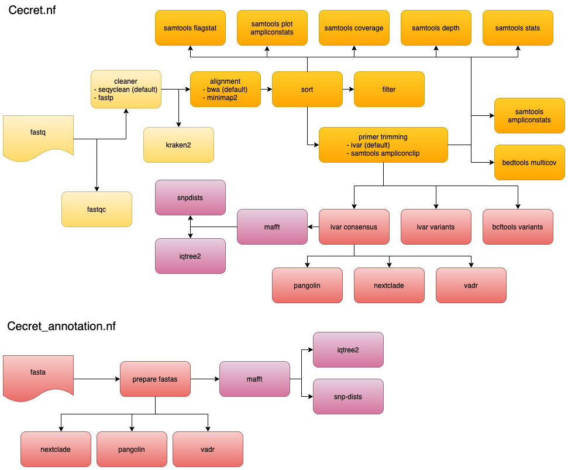

# Cecret


Named after the beautiful [Cecret lake](https://en.wikipedia.org/wiki/Cecret_Lake)

Location: 40.570°N 111.622°W , 9,875 feet (3,010 m) elevation

Cecret is a workflow developed by [@erinyoung](https://github.com/erinyoung) at the [Utah Public Health Laborotory](https://uphl.utah.gov/) for SARS-COV-2 sequencing with the [artic](https://artic.network/ncov-2019/ncov2019-bioinformatics-sop.html)/Illumina hybrid library prep workflow for MiSeq data with protocols [here](https://www.protocols.io/view/sars-cov-2-sequencing-on-illumina-miseq-using-arti-bffyjjpw) and [here](https://www.protocols.io/view/sars-cov-2-sequencing-on-illumina-miseq-using-arti-bfefjjbn). Built to work on linux-based operating systems. Additional config options are needed for cloud batch usage.

Cecret is also part of the [staphb-toolkit](https://github.com/StaPH-B/staphb_toolkit).

# Getting started

```
git clone https://github.com/UPHL-BioNGS/Cecret.git
```

To make your life easier, follow with

```
cd Cecret
git init
```

so that you can use `git pull` for updates.

## Prior to starting the workflow

### Install dependencies
- [Nextflow](https://www.nextflow.io/docs/latest/getstarted.html)
   - Nextflow version 20+ is required (`nextflow -v` to check your installation)
- [Singularity](https://singularity.lbl.gov/install-linux) or [Docker](https://docs.docker.com/get-docker/) 

# Usage

### Arrange paired-end fastq.gz reads as follows or designate directory with 'params.reads' or '--reads'
```
directory
└── reads
     └── *fastq.gz
```

### Arrange single-end fastq.gz reads as follows or designate directory with 'params.single_reads' or '--single_reads'
```
directory
└── single_reads
     └── *fastq.gz
```

WARNING : single and paired-end reads **cannot** be in the same directory

### Start the workflow

```
nextflow run Cecret.nf -c configs/singularity.config
```

## Full workflow(s)


## Optional toggles:

### Using fastp to clean reads instead of seqyclean
```
nextflow run Cecret.nf -c configs/singularity.config --cleaner fastp
```
Or set `params.cleaner = 'fastp'` in a config file

### Using samtools to trim amplicons instead of ivar
```
nextflow run Cecret.nf -c configs/singularity.config --trimmer samtools
```
Or set `params.trimmer = 'samtools'` in a config file

### Using minimap2 to align reads instead of bwa
```
nextflow run Cecret.nf -c configs/singularity.config --aligner minimap2
```
Or set `params.aligner = 'minimap2'` in a config file

### Determining relatedness
To create a multiple sequence alignment and corresponding phylogenetic tree and SNP matrix, set `params.relatedness = true` or 
```
nextflow run Cecret.nf -c configs/singularity.config --relatedness true
```
### Classify reads with kraken2
To classify reads with kraken2 to identify reads from human or the organism of your choice
#### Step 1. Get a kraken2 database (note : this link is no longer active. I'm actively working on creating my own)
```
mkdir kraken2_db
cd kraken2_db
wget ftp://ftp.ccb.jhu.edu/pub/data/kraken2_dbs/old/minikraken2_v2_8GB_201904.tgz
tar -zxvf minikraken2_v2_8GB_201904.tgz
```
#### Step 2. Set the paramaters accordingly
```
params.kraken2 = true
params.kraken2_db = 'kraken2_db'
params.kraken2_organism = "Severe acute respiratory syndrome-related coronavirus"
```

## The main components of Cecret are:

- [seqyclean](https://github.com/ibest/seqyclean) - for cleaning reads
- [fastp](https://github.com/OpenGene/fastp) - for cleaning reads ; optional, faster alternative to seqyclean
- [bwa](http://bio-bwa.sourceforge.net/) - for aligning reads to the reference
- [minimap2](https://github.com/lh3/minimap2) - an alternative to bwa
- [ivar](https://andersen-lab.github.io/ivar/html/manualpage.html) - calling variants and creating a consensus fasta; optional primer trimmer
- [samtools](http://www.htslib.org/) - for QC metrics and sorting; optional primer trimmer; optional converting bam to fastq files
- [fastqc](https://github.com/s-andrews/FastQC) - for QC metrics
- [bedtools](https://bedtools.readthedocs.io/en/latest/) - for depth estimation over amplicons
- [kraken2](https://ccb.jhu.edu/software/kraken2/) - for read classification
- [pangolin](https://github.com/cov-lineages/pangolin) - for lineage classification
- [nextclade](https://clades.nextstrain.org/) - for clade classification
- [vadr](https://github.com/ncbi/vadr) - for annotating fastas like NCBI
- [mafft](https://mafft.cbrc.jp/alignment/software/) - for multiple sequence alignment (optional, relatedness must be set to "true")
- [snp-dists](https://github.com/tseemann/snp-dists) - for relatedness determination (optional, relatedness must be set to "true")
- [iqtree2](http://www.iqtree.org/) - for phylogenetic tree generation (optional, relatedness must be set to "true")
- [bamsnap](https://github.com/parklab/bamsnap) - to create images of SNPs

### Turning off unneeded processes
It came to my attention that some processes (like bcftools) do not work consistently. Also, they might take longer than wanted and might not even be needed for the end user. Here's the processes that can be turned off with their default values:
```
params.bcftools_variants = false          # the container gets a lot of traffic which can error when attempting to download
params.fastqc = true                      # qc on the sequencing reads
params.ivar_variants = true               # itemize the variants identified by ivar
params.samtools_stats = true              # stats about the bam files
params.samtools_coverage = true           # stats about the bam files
params.samtools_depth = true              # stats about the bam files
params.samtools_flagstat = true           # stats about the bam files
params.samtools_ampliconstats = true      # stats about the amplicons
params.samtools_plot_ampliconstats = true # images related to amplicon performance
params.kraken2 = false                    # used to classify reads and needs a corresponding params.kraken2_db and organism if not SARS-CoV-2
params.bedtools_multicov = true           # bedtools multicov for coverage approximation of amplicons
params.nextclade = true                   # SARS-CoV-2 clade determination
params.pangolin = true                    # SARS-CoV-2 clade determination
params.vadr = false                       # NCBI fasta QC
params.relatedness = false                # actually the toggle for mafft to create a multiple sequence alignement
params.snpdists = true                    # creates snp matrix from mafft multiple sequence alignment
params.iqtree2 = true                     # creates phylogenetic tree from mafft multiple sequence alignement
params.bamsnap = false                    # can be really slow. Works best with bcftools variants. An example bamsnap image is below.
params.rename = false                     # needs a corresponding sample file and will rename files for GISAID and NCBI submission
params.filter = false                     # takes the aligned reads and turns them back into fastq.gz files
```

### Add Genbank parsable header to consensus fasta

This requires a comma-delimted file set with `params.sample_file` file with a row for each sample and a comma-delimited column for each item to add to the GenBank submission header. Additionally, adjust `params.rename = true`.

The following headers are required
- Sample_id          (required, must match sample_id*.fa*)
- Submission_id      (if file needs renaming)
- Collection_Date

Example covid_samples.csv file contents:
```
Sample_id,Submission_ID,Collection_Date,SRR
12345,UT-UPHL-12345,2020-08-22,SRR1
67890,UT-UPHL-67890,2020-08-22,SRR2
23456,UT-UPHL-23456,2020-08-22,SRR3
78901,UT-UPHL-78901,2020-08-18,SRR4
```
Where the files named `12345-UT-M03999-200822_S9_L001_R1_001.fastq.gz`, `12345-UT-M03999-200822_S9_L001_R2_001.fastq.gz` will be renamed `UT-UPHL-12345.R1.fastq.gz` and `UT-UPHL-12345.R2.fastq.gz`. A GISAID and GenBank friendly multifasta files ready for submission are also generated. The GenBank multifasta uses the input file to create fasta headers like
```
>12345 [Collection_Date=2020-08-22][organism=Severe acute respiratory syndrome coronavirus 2][host=human][country=USA][isolate=SARS-CoV-2/human/USA/12345/2020][SRR=SRR1]
NNNNNNNNNNNNNNNNNNNNNNNNNNNNNNNNNNNNNNNNNNN
```

Sometimes sequencing fails, so there are parameters for how many non-ambiguous bases a fasta needs in order to get incorporated into the final file. This can be set with `params.gisaid_threshold` (Default is '`params.gisaid_threshold = '25000'`') and params.genbank_threshold (Default is '`params.genbank_threshold = '15000'`').

## Final file structure
<details>
   <summary>Final File Tree after running cecret.nf</summary>

```
cecret_run_results.txt                # information about the sequencing run that's compatible with UPHL's legacy workflows
covid_samples.csv                     # only if supplied initially - used to rename files for submission
cecret                                # results from this workflow
├── aligned                           # aligned (with aligner) but untrimmed bam files with indexes
│   ├── SRR13957125.sorted.bam
│   ├── SRR13957125.sorted.bam.bai
│   ├── SRR13957170.sorted.bam
│   ├── SRR13957170.sorted.bam.bai
│   ├── SRR13957177.sorted.bam
│   └── SRR13957177.sorted.bam.bai
├── bamsnap                           # images for variants (if it works, default is 'false' for a reason)
│   └── sample
├── bcftools_variants                 # set to false by default; VCF files of variants identified
│   ├── SRR13957125.vcf
│   ├── SRR13957170.vcf
│   └── SRR13957177.vcf
├── bedtools_multicov                 # coverage for each amplicon
│   ├── SRR13957125.multicov.txt
│   ├── SRR13957170.multicov.txt
│   └── SRR13957177.multicov.txt
├── consensus                         # the likely reason you are running this workflow
│   ├── SRR13957125.consensus.fa
│   ├── SRR13957170.consensus.fa
│   └── SRR13957177.consensus.fa
├── fastp                             # optional tools for cleaning reads when 'params.cleaner = fastp'
│   ├── SRR13957125_clean_PE1.fastq.gz
│   ├── SRR13957125_clean_PE2.fastq.gz
│   ├── SRR13957125_fastp.html
│   ├── SRR13957125_fastp.json
│   ├── SRR13957170_clean_PE1.fastq.gz
│   ├── SRR13957170_clean_PE2.fastq.gz
│   ├── SRR13957170_fastp.html
│   ├── SRR13957170_fastp.json
│   ├── SRR13957177_clean_PE1.fastq.gz
│   ├── SRR13957177_clean_PE2.fastq.gz
│   ├── SRR13957177_fastp.html
│   └── SRR13957177_fastp.json
├── fastqc                            # QC metrics for each fasta sequence
│   ├── SRR13957125_1_fastqc.html
│   ├── SRR13957125_1_fastqc.zip
│   ├── SRR13957125_2_fastqc.html
│   ├── SRR13957125_2_fastqc.zip
│   ├── SRR13957170_1_fastqc.html
│   ├── SRR13957170_1_fastqc.zip
│   ├── SRR13957170_2_fastqc.html
│   ├── SRR13957170_2_fastqc.zip
│   ├── SRR13957177_1_fastqc.html
│   ├── SRR13957177_1_fastqc.zip
│   ├── SRR13957177_2_fastqc.html
│   └── SRR13957177_2_fastqc.zip
├── filter                           # fastq.gz files from reads that were aligned to the reference genome
│   ├── SRR13957125_filtered_R1.fastq.gz
│   ├── SRR13957125_filtered_R2.fastq.gz
│   ├── SRR13957125_filtered_unpaired.fastq.gz
│   ├── SRR13957170_filtered_R1.fastq.gz
│   ├── SRR13957170_filtered_R2.fastq.gz
│   ├── SRR13957170_filtered_unpaired.fastq.gz
│   ├── SRR13957177_filtered_R1.fastq.gz
│   ├── SRR13957177_filtered_R2.fastq.gz
│   └── SRR13957177_filtered_unpaired.fastq.gz
├── iqtree2                          # phylogenetic tree that is generated with 'params.relatedness = true'
│   ├── iqtree2.iqtree
│   ├── iqtree2.log
│   ├── iqtree2.mldist
│   └── iqtree2.treefile
├── ivar_trim                        # bam files after primers have been trimmed off the reads with ivar
│   ├── SRR13957125.primertrim.sorted.bam
│   ├── SRR13957125.primertrim.sorted.bam.bai
│   ├── SRR13957170.primertrim.sorted.bam
│   ├── SRR13957170.primertrim.sorted.bam.bai
│   ├── SRR13957177.primertrim.sorted.bam
│   └── SRR13957177.primertrim.sorted.bam.bai
├── ivar_variants                    # tsv and vcf files of variants identified in sample
│   ├── SRR13957125.ivar_variants.vcf
│   ├── SRR13957125.variants.tsv
│   ├── SRR13957170.ivar_variants.vcf
│   ├── SRR13957170.variants.tsv
│   ├── SRR13957177.ivar_variants.vcf
│   └── SRR13957177.variants.tsv
├── kraken2                          # kraken2 report of the organisms your reads may be from
│   ├── SRR13957125_kraken2_report.txt
│   ├── SRR13957170_kraken2_report.txt
│   └── SRR13957177_kraken2_report.txt
├── logs                             # divided log and err files for your QC and troubleshooting pleasure
│   └── processes*
│       ├── sample.run_id.err
│       └── sample.run_id.log
├── mafft                            # multiple sequence alignment created when 'params.relatedness = true' 
│   └── mafft_aligned.fasta
├── nextclade                        # nextclade reports
│   ├── combined_nextclade_report.txt
│   ├── SRR13957125
│   │   └── SRR13957125_nextclade.csv
│   ├── SRR13957170
│   │   └── SRR13957170_nextclade.csv
│   └── SRR13957177
│       └── SRR13957177_nextclade.csv
├── pangolin                         # pangolin reports
│   ├── combined_lineage_report.csv
│   ├── SRR13957125
│   │   └── lineage_report.csv
│   ├── SRR13957170
│   │   └── lineage_report.csv
│   └── SRR13957177
│       └── lineage_report.csv
├── samtools_ampliconstats           # amplicon statistics and metrics as determined by samtools
│   ├── SRR13957125_ampliconstats.txt
│   ├── SRR13957170_ampliconstats.txt
│   └── SRR13957177_ampliconstats.txt
├── samtools_coverage                # coverage and metrics as determined by samtools
│   └── aligned
│       ├── SRR13957125.cov.hist
│       ├── SRR13957125.cov.txt
│       ├── SRR13957170.cov.hist
│       ├── SRR13957170.cov.txt
│       ├── SRR13957177.cov.hist
│       └── SRR13957177.cov.txt
├── samtools_depth                   # the number of reads
│   ├── aligned
│   │   ├── SRR13957125.depth.txt
│   │   ├── SRR13957170.depth.txt
│   │   └── SRR13957177.depth.txt
│   └── trimmed
│       ├── SRR13957125.depth.txt
│       ├── SRR13957170.depth.txt
│       └── SRR13957177.depth.txt
├── samtools_flagstat                # flag information
│   ├── aligned
│   │   ├── SRR13957125.flagstat.txt
│   │   ├── SRR13957170.flagstat.txt
│   │   └── SRR13957177.flagstat.txt
│   └── trimmed
│       ├── SRR13957125.flagstat.txt
│       ├── SRR13957170.flagstat.txt
│       └── SRR13957177.flagstat.txt
├── samtools_plot_ampliconstats      # plots of the ampliconstats for troubleshooting purposes
│   ├── SRR13957125
│   ├── SRR13957125-combined-amp.gp
│   ├── SRR13957125-combined-amp.png
│   ├── SRR13957125-combined-coverage-1.gp
│   ├── SRR13957125-combined-coverage-1.png
│   ├── SRR13957125-combined-depth.gp
│   ├── SRR13957125-combined-depth.png
│   ├── SRR13957125-combined-read-perc.gp
│   ├── SRR13957125-combined-read-perc.png
│   ├── SRR13957125-combined-reads.gp
│   ├── SRR13957125-combined-reads.png
│   ├── SRR13957125-combined-tcoord.gp
│   ├── SRR13957125-combined-tcoord.png
│   ├── SRR13957125-combined-tdepth.gp
│   ├── SRR13957125-combined-tdepth.png
│   ├── SRR13957125-heat-amp-1.gp
│   ├── SRR13957125-heat-amp-1.png
│   ├── SRR13957125-heat-coverage-1-1.gp
│   ├── SRR13957125-heat-coverage-1-1.png
│   ├── SRR13957125-heat-read-perc-1.gp
│   ├── SRR13957125-heat-read-perc-1.png
│   ├── SRR13957125-heat-read-perc-log-1.gp
│   ├── SRR13957125-heat-read-perc-log-1.png
│   ├── SRR13957125-heat-reads-1.gp
│   ├── SRR13957125-heat-reads-1.png
│   ├── SRR13957125-SRR13957125.primertrim.sorted-amp.gp
│   ├── SRR13957125-SRR13957125.primertrim.sorted-amp.png
│   ├── SRR13957125-SRR13957125.primertrim.sorted-cov.gp
│   ├── SRR13957125-SRR13957125.primertrim.sorted-cov.png
│   ├── SRR13957125-SRR13957125.primertrim.sorted-reads.gp
│   ├── SRR13957125-SRR13957125.primertrim.sorted-reads.png
│   ├── SRR13957125-SRR13957125.primertrim.sorted-tcoord.gp
│   ├── SRR13957125-SRR13957125.primertrim.sorted-tcoord.png
│   ├── SRR13957125-SRR13957125.primertrim.sorted-tdepth.gp
│   ├── SRR13957125-SRR13957125.primertrim.sorted-tdepth.png
│   ├── SRR13957125-SRR13957125.primertrim.sorted-tsize.gp
│   ├── SRR13957125-SRR13957125.primertrim.sorted-tsize.png
│   ├── SRR13957170
│   ├── SRR13957170-combined-amp.gp
│   ├── SRR13957170-combined-amp.png
│   ├── SRR13957170-combined-coverage-1.gp
│   ├── SRR13957170-combined-coverage-1.png
│   ├── SRR13957170-combined-depth.gp
│   ├── SRR13957170-combined-depth.png
│   ├── SRR13957170-combined-read-perc.gp
│   ├── SRR13957170-combined-read-perc.png
│   ├── SRR13957170-combined-reads.gp
│   ├── SRR13957170-combined-reads.png
│   ├── SRR13957170-combined-tdepth.gp
│   ├── SRR13957170-combined-tdepth.png
│   ├── SRR13957170-heat-amp-1.gp
│   ├── SRR13957170-heat-amp-1.png
│   ├── SRR13957170-heat-coverage-1-1.gp
│   ├── SRR13957170-heat-coverage-1-1.png
│   ├── SRR13957170-heat-read-perc-1.gp
│   ├── SRR13957170-heat-read-perc-1.png
│   ├── SRR13957170-heat-read-perc-log-1.gp
│   ├── SRR13957170-heat-read-perc-log-1.png
│   ├── SRR13957170-heat-reads-1.gp
│   ├── SRR13957170-heat-reads-1.png
│   ├── SRR13957170-SRR13957170.primertrim.sorted-amp.gp
│   ├── SRR13957170-SRR13957170.primertrim.sorted-amp.png
│   ├── SRR13957170-SRR13957170.primertrim.sorted-cov.gp
│   ├── SRR13957170-SRR13957170.primertrim.sorted-cov.png
│   ├── SRR13957170-SRR13957170.primertrim.sorted-reads.gp
│   ├── SRR13957170-SRR13957170.primertrim.sorted-reads.png
│   ├── SRR13957170-SRR13957170.primertrim.sorted-tdepth.gp
│   ├── SRR13957170-SRR13957170.primertrim.sorted-tdepth.png
│   ├── SRR13957177
│   ├── SRR13957177-combined-amp.gp
│   ├── SRR13957177-combined-amp.png
│   ├── SRR13957177-combined-coverage-1.gp
│   ├── SRR13957177-combined-coverage-1.png
│   ├── SRR13957177-combined-depth.gp
│   ├── SRR13957177-combined-depth.png
│   ├── SRR13957177-combined-read-perc.gp
│   ├── SRR13957177-combined-read-perc.png
│   ├── SRR13957177-combined-reads.gp
│   ├── SRR13957177-combined-reads.png
│   ├── SRR13957177-combined-tcoord.gp
│   ├── SRR13957177-combined-tcoord.png
│   ├── SRR13957177-combined-tdepth.gp
│   ├── SRR13957177-combined-tdepth.png
│   ├── SRR13957177-heat-amp-1.gp
│   ├── SRR13957177-heat-amp-1.png
│   ├── SRR13957177-heat-coverage-1-1.gp
│   ├── SRR13957177-heat-coverage-1-1.png
│   ├── SRR13957177-heat-read-perc-1.gp
│   ├── SRR13957177-heat-read-perc-1.png
│   ├── SRR13957177-heat-read-perc-log-1.gp
│   ├── SRR13957177-heat-read-perc-log-1.png
│   ├── SRR13957177-heat-reads-1.gp
│   ├── SRR13957177-heat-reads-1.png
│   ├── SRR13957177-SRR13957177.primertrim.sorted-amp.gp
│   ├── SRR13957177-SRR13957177.primertrim.sorted-amp.png
│   ├── SRR13957177-SRR13957177.primertrim.sorted-cov.gp
│   ├── SRR13957177-SRR13957177.primertrim.sorted-cov.png
│   ├── SRR13957177-SRR13957177.primertrim.sorted-reads.gp
│   ├── SRR13957177-SRR13957177.primertrim.sorted-reads.png
│   ├── SRR13957177-SRR13957177.primertrim.sorted-tcoord.gp
│   ├── SRR13957177-SRR13957177.primertrim.sorted-tcoord.png
│   ├── SRR13957177-SRR13957177.primertrim.sorted-tdepth.gp
│   ├── SRR13957177-SRR13957177.primertrim.sorted-tdepth.png
│   ├── SRR13957177-SRR13957177.primertrim.sorted-tsize.gp
│   └── SRR13957177-SRR13957177.primertrim.sorted-tsize.png
├── samtools_stats                   # stats as determined by samtools
│   ├── aligned
│   │   ├── SRR13957125.stats.txt
│   │   ├── SRR13957170.stats.txt
│   │   └── SRR13957177.stats.txt
│   └── trimmed
│       ├── SRR13957125.stats.trim.txt
│       ├── SRR13957170.stats.trim.txt
│       └── SRR13957177.stats.trim.txt
├── seqyclean                        # reads that have had PhiX and adapters removed
│   ├── Combined_SummaryStatistics.tsv
│   ├── SRR13957125_clean_PE1.fastq.gz
│   ├── SRR13957125_clean_PE2.fastq.gz
│   ├── SRR13957125_clean_SummaryStatistics.tsv
│   ├── SRR13957125_clean_SummaryStatistics.txt
│   ├── SRR13957170_clean_PE1.fastq.gz
│   ├── SRR13957170_clean_PE2.fastq.gz
│   ├── SRR13957170_clean_SummaryStatistics.tsv
│   ├── SRR13957170_clean_SummaryStatistics.txt
│   ├── SRR13957177_clean_PE1.fastq.gz
│   ├── SRR13957177_clean_PE2.fastq.gz
│   ├── SRR13957177_clean_SummaryStatistics.tsv
│   └── SRR13957177_clean_SummaryStatistics.txt
├── snp-dists                        # SNP matrix created with 'params.relatedness = true'
│   └── snp-dists.txt
├── submission_files                 # optional functionality that requires a key and renames files when 'params.rename = true'
│   ├── UT-UPHL-2103503681_filtered_R1.fastq.gz
│   ├── UT-UPHL-2103503681_filtered_R2.fastq.gz
│   ├── UT-UPHL-2103503681.genbank.fa
│   ├── UT-UPHL-2103503681.gisaid.fa
│   ├── UT-UPHL-2103929243_filtered_R1.fastq.gz
│   ├── UT-UPHL-2103929243_filtered_R2.fastq.gz
│   ├── UT-UPHL-2103929243.genbank.fa
│   ├── UT-UPHL-2103929243.gisaid.fa
│   ├── UT-UPHL-2103954304_filtered_R1.fastq.gz
│   └── UT-UPHL-2103954304_filtered_R2.fastq.gz
├── summary                          # summary files with condensed results
│   ├── SRR13957125.summary.csv
│   ├── SRR13957125.summary.txt
│   ├── SRR13957170.summary.csv
│   ├── SRR13957170.summary.txt
│   ├── SRR13957177.summary.csv
│   └── SRR13957177.summary.txt
├── summary.csv
└── vadr                             # QC that mimics NCBI's metrics
    ├── combined_vadr.fail.fasta
    ├── combined_vadr.fail.list
    ├── combined_vadr.pass.fasta
    ├── combined_vadr.pass.list
    ├── combined_vadr.sqc
    ├── SRR13957125
    │   ├── SRR13957125.vadr.alc
    │   ├── SRR13957125.vadr.alt
    │   ├── SRR13957125.vadr.alt.list
    │   ├── SRR13957125.vadr.cmd
    │   ├── SRR13957125.vadr.dcr
    │   ├── SRR13957125.vadr.fail.fa
    │   ├── SRR13957125.vadr.fail.list
    │   ├── SRR13957125.vadr.fail.tbl
    │   ├── SRR13957125.vadr.filelist
    │   ├── SRR13957125.vadr.ftr
    │   ├── SRR13957125.vadr.log
    │   ├── SRR13957125.vadr.mdl
    │   ├── SRR13957125.vadr.pass.fa
    │   ├── SRR13957125.vadr.pass.list
    │   ├── SRR13957125.vadr.pass.tbl
    │   ├── SRR13957125.vadr.rpn
    │   ├── SRR13957125.vadr.sda
    │   ├── SRR13957125.vadr.seqstat
    │   ├── SRR13957125.vadr.sgm
    │   ├── SRR13957125.vadr.sqa
    │   └── SRR13957125.vadr.sqc
    └── SRR13957177
        ├── SRR13957177.vadr.alc
        ├── SRR13957177.vadr.alt
        ├── SRR13957177.vadr.alt.list
        ├── SRR13957177.vadr.cmd
        ├── SRR13957177.vadr.dcr
        ├── SRR13957177.vadr.fail.fa
        ├── SRR13957177.vadr.fail.list
        ├── SRR13957177.vadr.fail.tbl
        ├── SRR13957177.vadr.filelist
        ├── SRR13957177.vadr.ftr
        ├── SRR13957177.vadr.log
        ├── SRR13957177.vadr.mdl
        ├── SRR13957177.vadr.pass.fa
        ├── SRR13957177.vadr.pass.list
        ├── SRR13957177.vadr.pass.tbl
        ├── SRR13957177.vadr.rpn
        ├── SRR13957177.vadr.sda
        ├── SRR13957177.vadr.seqstat
        ├── SRR13957177.vadr.sgm
        ├── SRR13957177.vadr.sqa
        └── SRR13957177.vadr.sqc
reads                                # user supplied fastq files for analysis
work                                 # nextflow's working directories

```

</details>
   
# **A FILE THAT THE END USER/YOU CAN COPY AND EDIT IS FOUND AT [configs/cecret_config_template.config](configs/cecret_config_template.config)**
This file contains all of the configurable parameters with their default values. If you are using some sort of cloud or HPC setup, I highly recommend you copy this and edit it appropriately. A limited list of parameters is listed below:

### input and output directories
* params.reads = workflow.launchDir + '/reads'
* params.single_reads = workflow.launchDir + '/single_reads'
* params.outdir = workflow.launchDir + "/cecret"

### reference files for SARS-CoV-2 with artic V3 primers (part of the github repository)
* params.reference_genome = workflow.projectDir + "/configs/MN908947.3.fasta"
* params.gff_file = workflow.projectDir + "/configs/MN908947.3.gff"
* params.primer_bed = workflow.projectDir + "/configs/artic_V3_nCoV-2019.bed"
* params.amplicon_bed = workflow.projectDir + "/configs/nCoV-2019.insert.bed"

### Other useful options
* To "resume" a workflow that use `-resume` with your nextflow command
* To create a report, use `-with-report` with your nextflow command
* To use nextflow tower, use `-with-tower` with your nextflow command

# Frequently Asked Questions (aka FAQ)
## What do I do if I encounter an error?

**TELL ME ABOUT IT!!!**
* [Github issue](https://github.com/UPHL-BioNGS/Cecret/issues)
* Email me
* Send me a message on slack

Be sure to include the command that you used, what config file you used, and what the **nextflow** error was. 

## What if I want to test the workflow?

In the [data](./data) directory of this repository, there are three sets of fastq.gz files with a corresponding results file for comparison.

```
nextflow run Cecret.nf -c configs/singularity.config --reads data
nextflow run Cecret_annotation.nf -c configs/singularity.config --fastas data
```

## What if I just want to annotate some SARS-CoV-2 fastas with pangolin, nextclade and vadr?
```
nextflow run Cecret_annotation.nf -c configs/singularity.config --fastas <directory with fastas>
```
You can run mafft, snpdists, and iqtree on a collection of fastas as well with
```
nextflow run Cecret_annotation.nf -c configs/singularity.config --relatedness true --fastas <directory with fastas>
```
[Cecret_annotation.nf](./Cecret_annotation.nf) Uses the same basic structure as the main workflow, so the same config file can probably be used for both.

## Where is an example config file?
You're more than welcome to look at what we use here at UPHL [here](./configs/UPHL.config).

## How can I tell if certain amplicons are failing?

There are two ways to do this. 

### With bedtools multicov : 
`cecret/bedtools_multicov` has a file for each sample.
This is standard bedtools multicov output, so it doesn't have a header.

- Column 1 : The reference
- Column 2 : Start of amplicon
- Column 3 : End of amplicon
- Column 4 : Amplicon number
- Column 5-6 : version number and strand from bedfile
- Column 7 : (Column G) is the depth observed for that amplicon for that sample.

### With samtools ampliconstats :
`cecret/samtools_ampliconstats` has a file for each sample
Row number 126 (FDEPTH) has a column for each amplicon (also without a header). To get this row for all of your samples, you can grep the keyword "FDEPTH" from each sample.

```
grep "^FDEPTH" cecret/samtools_ampliconstats/* > samtools_ampliconstats_all.tsv
``` 

There are corresponding images in `cecret/samtools_plot_ampliconstats` for each sample.

### Sample samtools plot ampliconstats depth graph


## Why is bcftools set to 'false' by default?

There's nothing wrong with the bcftools process, and the vcf created by bcftools is rather handy for additional analyses. The `'staphb/bcftools:latest'` container is really popular, and has issues downloading during high traffic times. I don't have the time to handle issues of users not understanding why the container did not download. /Sorry

If you want to get the output from bcftools, set `params.bcftools = true` 

## What is the difference between `params.amplicon_bed` and `params.primer_bed`?

The primer bedfile is the file with the start and stop of each **primer** sequence.

```
$ head -n 3 artic_V3_nCoV-2019.bed 
MN908947.3	30	54	nCoV-2019_1_LEFT	nCoV-2019_1	+
MN908947.3	385	410	nCoV-2019_1_RIGHT	nCoV-2019_1	-
MN908947.3	320	342	nCoV-2019_2_LEFT	nCoV-2019_2	+
```
The amplicon bedfile is the file with the start and stop of each intended **amplicon**.
```
$ head -n 3 nCoV-2019.insert.bed 
MN908947.3	54	385	1	1	+
MN908947.3	342	704	2	2	+
MN908947.3	664	1004	3	1	+
```
Due to the many varieties of primer bedfiles, I determined it was best if the user supplied this file for custom primer sequences.

## What if I am using an amplicon based library that is not SARS-CoV-2?

In your config file, change the following relevant parameters:
```
params.reference_genome
params.primer_bed
params.amplicon_bed or set params.bedtools_multicov = false
params.gff_file or set params.ivar_variants = false
```
And set
```
params.pangolin = false 
params.nextclade = false
params.vadr = false or configure your vadr container appropriately and params.vadr_reference
```
## What if I need to filter out human reads or I only want reads that map to my reference?

Although not perfect, if `'params.filter = true'`, then only the reads that were mapped to the reference are returned. This should eliminate all human contamination (as long as human is not part of your reference). 

## This workflow has too many bells and whistles. I really only care about generating a consensus fasta. How do I get rid of all the extras?

Change the parameters in your config file and set most of them to false. 

```
params.fastqc = false
params.ivar_variants = false
params.samtools_stats = false
params.samtools_coverage = false
params.samtools_depth = false
params.samtools_flagstat = false
params.bedtools_multicov = false
params.samtools_ampliconstats = false
params.samtools_plot_ampliconstats = false
params.bedtools_multicov = false
params.pangolin = false
params.nextclade = false
params.vadr = false
```
And, yes, this means I added some bells and whistles so you could turn off the bells and whistles. /irony

## Can I get images of my SNPs and indels?

Yes. Set `params.bamsnap = true`. This is false by default because of how long it takes. It will work with variants called by `ivar` and `bcftools`, although it is **MUCH** faster with the vcf created by bcftools. 

Warning : will not work on all variants. This is due to how bamsnap runs. It is even less likely to work on indels. 

### Sample bamsnap plot


